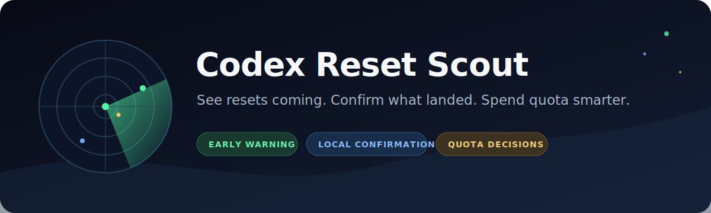
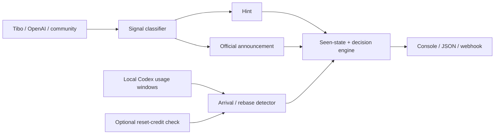

# Codex Reset Scout



**See resets coming. Confirm what landed. Spend quota smarter.**

[](https://github.com/xlsophiebrighter-beep/codex-reset-scout/actions/workflows/ci.yml)
[](LICENSE)
[](pyproject.toml)

Codex Reset Scout is a local-first early-warning CLI for Codex usage-limit
resets. It watches public signals before a reset, correlates those signals with
local window changes, estimates unused allowance before an early rebase, and
recommends whether to spend quota, wait, or consider a banked reset credit.

Most quota tools start after the interesting event. Scout treats a reset as a
three-stage event:

1. **Hint** — a milestone, celebration, or credible pre-signal appears.
2. **Announcement** — Tibo/OpenAI explicitly promises or starts a reset.
3. **Local arrival** — an early local rebase aligns with a public reset signal,
   or is clearly labelled as an uncorroborated local observation.

## Why it is different

- Public warning comes before local confirmation.
- A direct official/Tibo signal can alert immediately.
- Community claims require corroboration, reducing rumor noise.
- Local reads are passive: no model request, no automatic card redemption.
- Tokens, account IDs, raw auth payloads, and session text never enter output.
- State is durable and stage-aware, so a hint, announcement, and arrival each
  notify once.



## Quick start

```bash
git clone https://github.com/xlsophiebrighter-beep/codex-reset-scout.git
cd codex-reset-scout
python -m venv .venv
```

Activate the environment, then install:

```bash
python -m pip install -e .
codex-scout doctor
codex-scout check
```

Useful commands:

```bash
# Public sources plus passive local JSONL usage-window inspection
codex-scout check

# Machine-readable report for automation
codex-scout check --json

# Public-only mode (safe for a server or GitHub Actions)
codex-scout check --no-local

# Continuous checks; only new stages notify
codex-scout watch --interval 3600

# Experimental, explicit opt-in read of banked reset credits
codex-scout credits
codex-scout check --include-credits
```

## Public sources

| Source | Role | Trust handling |
| --- | --- | --- |
| Tibo (`@thsottiaux`) RSS mirror(s) | Hints and direct statements | Original X status links are preserved; additional mirrors can be configured |
| OpenAI Status | Official incidents | Direct official signal |
| OpenAI Developer Community | Announcements and reports | Treated as community evidence unless independently corroborated |
| `openai/codex` issues | Fresh account and client reports | Community evidence |
| Reddit `r/codex` | Fast but noisy reports | Community evidence |
| Extra RSS/Atom feeds | User-supplied sources | Trust is explicit in configuration |

X and third-party mirrors can fail or rate-limit. Scout records source health and
surfaces degraded coverage instead of silently claiming that there is no news.
Community reports must come from different sources within a six-hour cluster;
undated entries are ignored. Planning advisories also expire, and a later reset
announcement suppresses older milestone hints, so stale posts cannot keep
driving “spend now” advice.

## Configuration

Copy [`examples/config.example.json`](examples/config.example.json) to the
platform configuration directory printed by `codex-scout doctor --show-paths`.
Plain `doctor` output redacts absolute paths so it is safer to paste into an
issue or support conversation.

Environment overrides:

- `CODEX_SCOUT_CONFIG` — configuration file path.
- `CODEX_SCOUT_STATE` — durable seen-state path.
- `CODEX_SCOUT_WEBHOOK_URL` — optional JSON webhook target.
- `CODEX_HOME` — Codex home directory; defaults to `~/.codex`.

Do not commit a real webhook URL or any authentication file.

## Safety model

The default check reads public URLs and scans local Codex session JSONL files to
locate `token_count.rate_limits` records. It does not extract, retain, or output
prompt/response content. Output also omits session paths and identifiers.

The `credits` command is experimental and opt-in. It reads the local Codex access
token into memory and calls the same read-only reset-credit endpoint used by the
Codex client. It never prints or stores the token, raw response, account ID, or
credit ID. This endpoint is not a stable public API and may change without notice.

Scout never:

- redeems a reset credit;
- switches accounts or replaces `auth.json`;
- sends a model request to create a usage window;
- uploads local usage history;
- promises that a community rumor is official.

## Exit behavior

- `0` — check completed; inspect JSON/text for any new alerts.
- `1` — configuration, local, explicit credit-query, or webhook-delivery error.
- `2` — invalid command-line use.

Webhook and automation users should inspect `new_alerts` and `source_health` in
the JSON report rather than relying only on process exit status.

## Development

```bash
python -m pip install -e ".[dev]"
python -m ruff check .
python -m pytest
python -m compileall -q src
```

CI runs on Windows, macOS, and Linux with supported Python versions.

## Roadmap

- Native Windows/macOS tray notifications.
- Burn-rate forecasting and reset-waste charts.
- Optional SQLite history for long-running installations.
- Notification adapters for Discord, Telegram, ntfy, and email.
- A separate, opt-in goal guardian for overnight Codex desktop work.

## Prior art

Scout was designed after studying the feature boundaries of
[`codex-reset-checker`](https://github.com/doggy8088/codex-reset-checker),
[`codex-reset-watcher`](https://github.com/jordan-edai/codex-reset-watcher), and
[`codex-usage-tracker`](https://github.com/douglasmonsky/codex-usage-tracker).
The implementation in this repository is independent; no third-party source
code is vendored.

## Disclaimer

This is an unofficial community project and is not affiliated with or endorsed
by OpenAI or GitHub. “Codex”, “OpenAI”, “GitHub”, and related marks belong to
their respective owners. Usage limits and private client endpoints can change.
